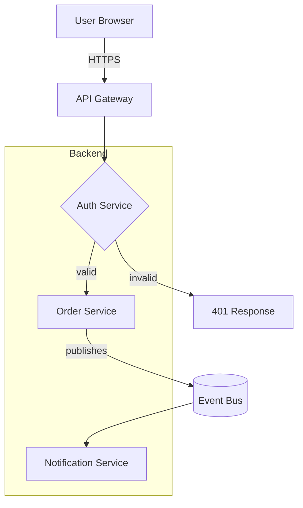
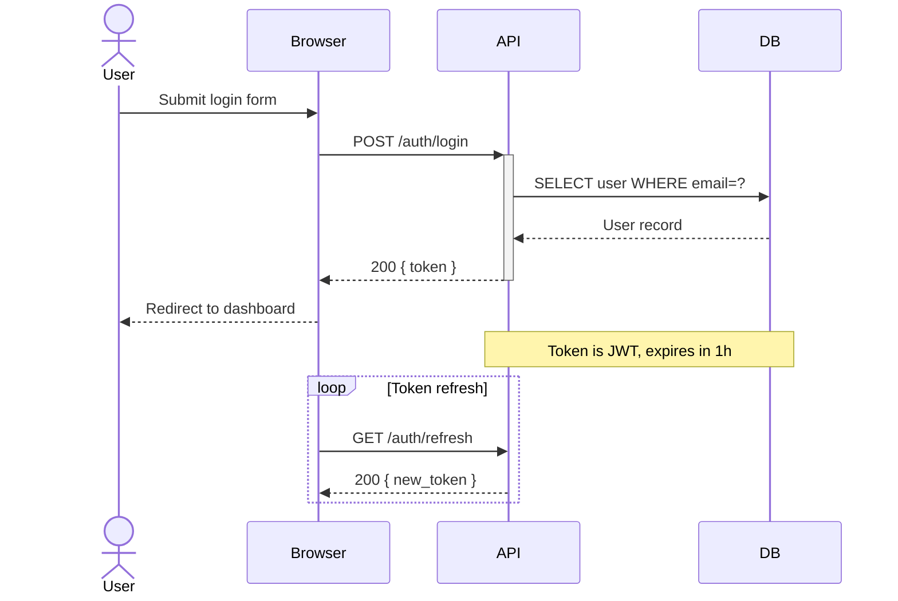
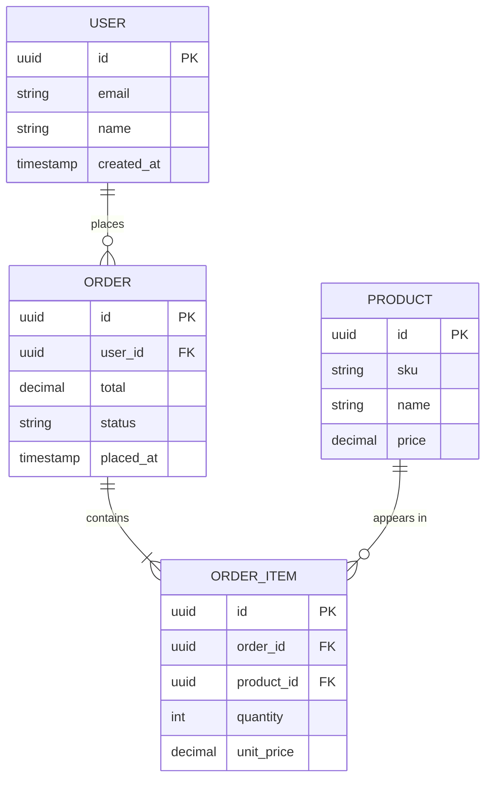
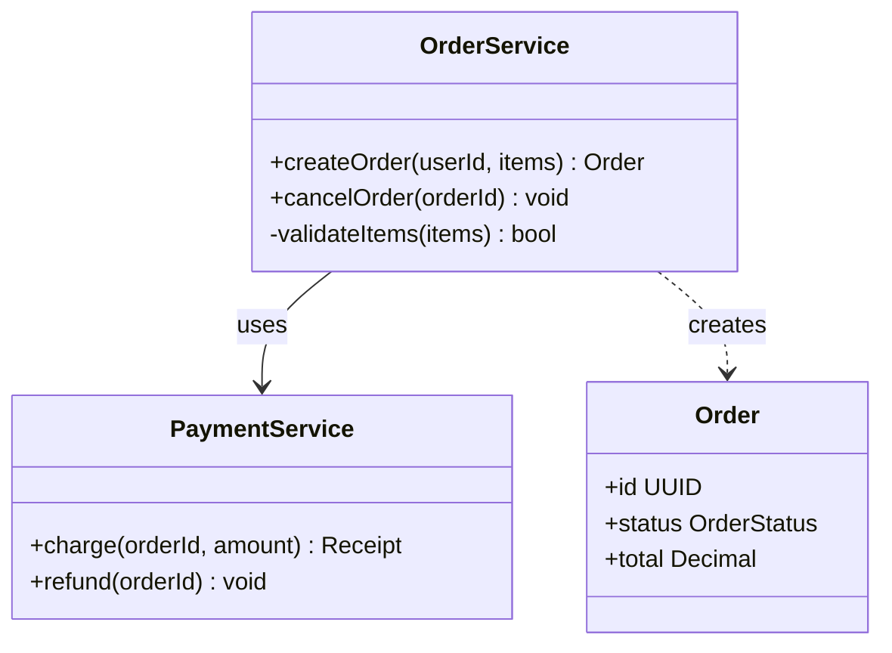

# Mermaid Syntax Reference

Quick reference for the four diagram types this skill uses. Validate your output mentally against these patterns before emitting.

---

## Flowchart / Graph (architecture, flow)

**Node shapes:**
- `[Text]` — rectangle (process, service)
- `(Text)` — rounded rectangle (start/end)
- `{Text}` — diamond (decision)
- `[(Text)]` — cylinder (database)
- `[[Text]]` — subroutine
- `((Text))` — circle (event)
- `>Text]` — flag/asymmetric

**Edge labels:** `A -->|label| B`  
**Subgraphs:** `subgraph Name ... end`  
**Styling:** `style A fill:#f9f,stroke:#333`  
**Click links:** `click A href "url"`

---

## Sequence Diagram

**Arrow types:**
- `->>` solid arrow (synchronous call)
- `-->>` dashed arrow (response)
- `-x` arrow with cross (async/fire-and-forget)
- `-)` open arrow (async)

**Activations:** `+Participant` / `-Participant`  
**Notes:** `Note over A,B: text` or `Note right of A: text`  
**Loops/alt:** `loop`, `alt`/`else`, `opt`, `par`, `critical`

---

## Entity-Relationship Diagram

**Cardinality:**
- `||` exactly one
- `o|` zero or one
- `||` one (exact)
- `}|` one or more
- `}o` zero or more
- `{` (left side mirror)

**Relationship label:** always a verb phrase in quotes.  
**Attributes:** `type name [PK|FK|UK]`

---

## Class Diagram (component/module structure)

**Relationships:**
- `-->` association
- `..>` dependency
- `--|>` inheritance
- `..|>` realisation (interface)
- `--*` composition
- `--o` aggregation

---

## Common mistakes to avoid

- Spaces in node IDs without quotes: use `A["My Node"]` not `A[My Node]`.
- Arrow label spaces: `A -->|label| B` works; `A --> |label| B` does not.
- ER cardinality direction: the left entity is the "one" side in `||--o{`.
- `sequenceDiagram` must have at least one `participant` or `actor` before using it.
- Nested subgraphs work in flowchart; avoid them in sequence diagrams.
- Mermaid does not support multi-line node labels — keep labels short.
