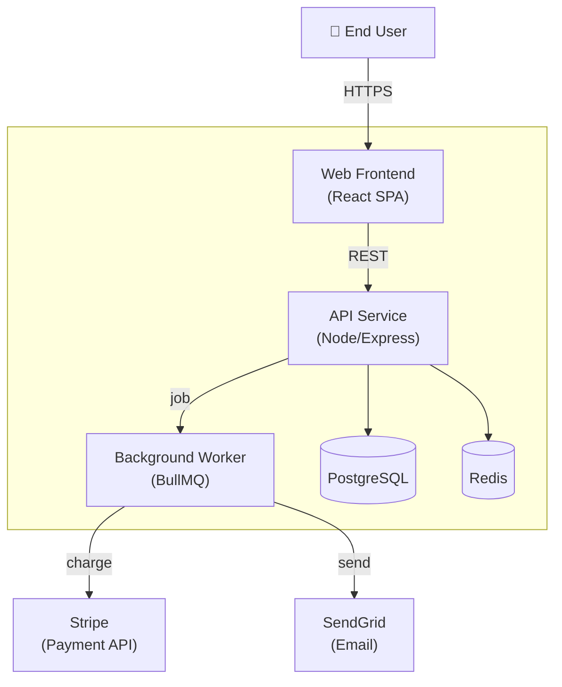

# Workflow — Architecture Diagram (C4)

Generate a C4-style architecture diagram using Mermaid flowchart syntax.

## When you reach here

The user wants a structural view of the system — what services, datastores, and external actors exist and how they relate. See [references/diagram-types.md](../references/diagram-types.md) for the C4 level guide.

## Steps

### 1. Determine the C4 level

| User says | Level |
|-----------|-------|
| "overview", "big picture", "system context" | L1 — System context |
| "services", "containers", "deployment" | L2 — Containers (default) |
| "modules", "components inside X" | L3 — Components |

Default to **L2** if the level is not specified.

### 2. Gather sources

Read in parallel:

**From memory ledger:**
```bash
python .claude/skills/memory/scripts/ledger.py list --status accepted --type decision
python .claude/skills/memory/scripts/ledger.py list --status accepted --type plan
```
Show the entries that describe components, services, or infrastructure.

**From codebase:**
```bash
# Find services / apps
find . -name "docker-compose*" -o -name "Dockerfile" | head -20
find . -maxdepth 2 -name "package.json" -o -name "pyproject.toml" -o -name "go.mod" | head -20
# Find infra-as-code
find . -name "*.tf" -o -name "*.yml" -path "*/k8s/*" | head -20
```

Read the relevant files. Never invent components.

### 3. Identify diagram elements

From your reading, extract:

- **External actors** — users, external services, third-party APIs
- **Internal services** — your own backends, workers, schedulers
- **Datastores** — databases, caches, object storage, queues
- **Frontends** — web, mobile, CLI
- **Boundaries** — which components are inside vs. outside your system

### 4. Draw the diagram

Follow [references/mermaid.md](../references/mermaid.md) — use `flowchart TD` or `flowchart LR`.



Rules:
- Label every arrow with the protocol or action.
- Use `subgraph` to mark your system boundary.
- Use node shapes to distinguish type: `[text]` service, `[(text)]` datastore, `((text))` event/queue.
- Keep node count under 15 — split into separate L3 diagrams if more detail is needed.

### 5. Add a title and description

Wrap the output in a Markdown block:

```markdown
## Architecture — <System Name> (L2 Containers)

> <One-line description of what this shows and when it was generated>

```mermaid
...
```
```

### 6. Record to the ledger

Include a `source:<id>` tag for every ledger entry that contributed to this
diagram. Rollback uses these tags to find and mark the diagram stale automatically.

```bash
python .claude/skills/memory/scripts/ledger.py log \
  --type artifact \
  --title "Diagram: architecture L<N> — <slug>" \
  --source /diagram \
  --tags "diagram,architecture,mermaid,source:<id1>,source:<id2>,..." \
  --body "C4 L<N> container diagram for <system>. Generated from ledger entries <ids> and codebase paths <paths>. Path: <output path if saved to file>."
```
