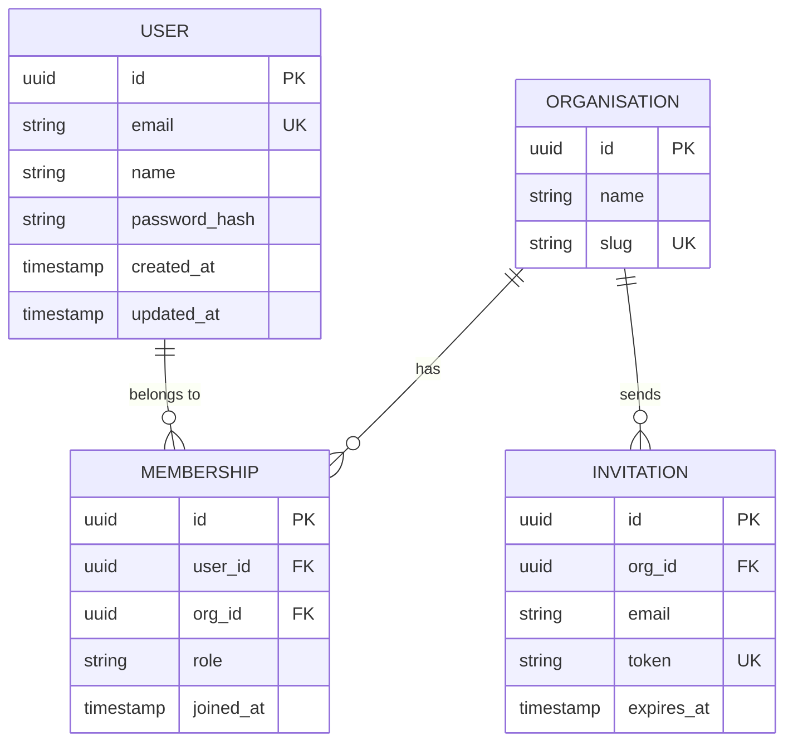

# Workflow — ER Diagram

Generate a Mermaid ER diagram from the data model — schema files, ORM models, migrations, or type definitions.

## When you reach here

The user wants to see data entities and relationships — for a design review, onboarding, or documentation. See [references/diagram-types.md](../references/diagram-types.md).

## Steps

### 1. Locate the data model

```bash
# ORM models
find . -path "*/models/*" -name "*.ts" -o -path "*/models/*" -name "*.py" | head -20
find . -name "schema.prisma" -o -name "*.schema.ts" -o -name "models.py" | head -10

# Migrations
find . -path "*/migrations/*" -name "*.sql" | sort | tail -10

# GraphQL / OpenAPI schemas
find . -name "*.graphql" -o -name "openapi.yml" -o -name "schema.json" | head -10
```

Read the relevant files. Only model what is actually defined — do not infer fields from usage.

### 2. Determine scope

If the codebase has many entities, limit to the domain the user asked about (e.g. "the order domain", "the user and auth tables"). Asking the user is better than drawing a 30-entity diagram no one can read.

### 3. Draw the diagram

Follow [references/mermaid.md](../references/mermaid.md) — use `erDiagram`.



Rules:
- Include all fields for entities central to the domain. For peripheral entities, show only the PK and FKs.
- Mark `PK`, `FK`, `UK` (unique key) on every relevant field.
- Label every relationship with a verb phrase (not just a line).
- Cardinality must match the actual schema constraint — check nullable and unique constraints.
- Keep to one bounded domain per diagram. Link to other diagrams for cross-domain entities.

### 4. Add a title and description

```markdown
## Data Model — <Domain Name>

> <One-line description: what entities this covers and the source files>

```mermaid
...
```
```

### 5. Record to the ledger

```bash
python .claude/skills/memory/scripts/ledger.py log \
  --type artifact \
  --title "Diagram: ER — <domain>" \
  --source /diagram \
  --tags diagram,er,mermaid,data-model \
  --body "ER diagram for <domain> domain. Generated from <source files>. Path: <output path if saved>."
```
