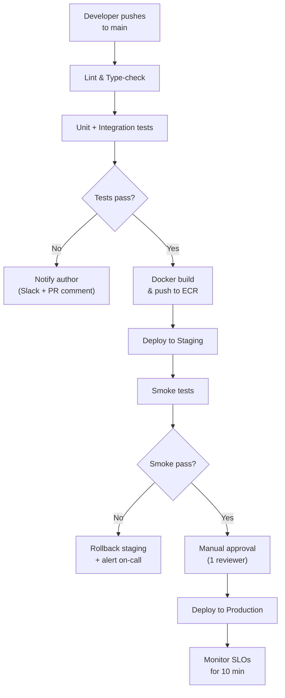

# Workflow — Flow Diagram

Generate a Mermaid flowchart showing data movement, pipeline steps, or decision logic.

## When you reach here

The user wants to see a process — a data pipeline, a CI/CD workflow, a release process, a business rule decision tree. This is about steps and data movement, not component topology (use architecture) or timed interactions (use sequence).

## Steps

### 1. Identify the process

From the user's request, determine:

- The **starting point** (trigger or input)
- The **ending point(s)** (output or outcome)
- The **steps in between** (transforms, decisions, branches, parallel paths)
- Any **loops** or **retry** logic

### 2. Gather sources

```bash
# CI/CD pipelines
find . -name "*.yml" -path "*/.github/workflows/*" | head -10
find . -name "Makefile" -o -name "Taskfile*" | head -5

# Data pipeline scripts
find . -name "*.py" -path "*/pipelines/*" -o -path "*/etl/*" | head -10

# IaC / deploy scripts
find . -name "*.sh" -o -name "deploy*" | head -10
```

Also read ledger entries tagged `rollout`, `deploy`, or `data`:

```bash
python .claude/skills/memory/scripts/ledger.py list --status accepted
```

### 3. Draw the diagram

Follow [references/mermaid.md](../references/mermaid.md) — use `flowchart TD` (top-down) for pipelines and `flowchart LR` (left-right) for decision trees and horizontal flows.



Rules:
- Use diamonds `{text}` for decision points; label both branches.
- Use rectangles `[text]` for actions; parallelograms `[/text/]` for I/O steps.
- Group related steps with `subgraph` (e.g. one subgraph per environment or stage).
- Label arrows when the condition or data being passed is not obvious.
- Show error/rollback paths — a flow without an error path is incomplete.
- Keep depth under 10 steps vertically. If longer, split into sub-flows and cross-link them.

### 4. Add a title and description

```markdown
## Flow — <Process Name>

> <One-line description: what triggers this flow, what it produces, and which team owns it>

```mermaid
...
```
```

### 5. Record to the ledger

Include a `source:<id>` tag for every ledger entry that contributed to this diagram.

```bash
python .claude/skills/memory/scripts/ledger.py log \
  --type artifact \
  --title "Diagram: flow — <process name>" \
  --source /diagram \
  --tags "diagram,flow,mermaid,source:<id1>,..." \
  --body "Flow diagram for <process>. Generated from ledger entries <ids> and source files <paths>. Path: <output path if saved>."
```
