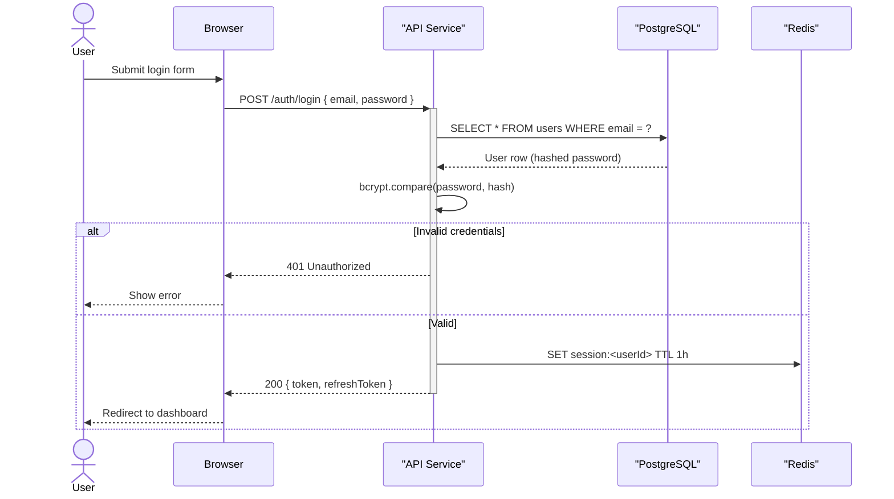

# Workflow — Sequence Diagram

Generate a Mermaid sequence diagram showing how actors and components interact over time.

## When you reach here

The user wants to see the order of calls in a flow — an auth sequence, a checkout journey, an event-driven pipeline, an API contract. See [references/diagram-types.md](../references/diagram-types.md).

## Steps

### 1. Identify the flow

From the user's request, name:

- The **trigger** (what starts the sequence — a user action, a cron job, an event)
- The **actors / participants** involved
- The **happy path** (primary success scenario)
- Any **error paths** or **conditional branches** to include

If the user named a specific flow (e.g. "the login flow"), read the relevant code to ground the sequence in reality.

### 2. Gather sources

```bash
# Find the handler for the named flow
grep -r "login\|authenticate\|checkout\|payment" --include="*.ts" --include="*.py" -l | head -10

# Read the relevant file(s)
```

Also read any ledger decisions tagged with the domain (auth, payments, etc.):

```bash
python .claude/skills/memory/scripts/ledger.py list --status accepted
```

### 3. Draw the diagram

Follow [references/mermaid.md](../references/mermaid.md) — use `sequenceDiagram`.



Rules:
- Use `actor` for human participants, `participant` for systems.
- Use `+`/`-` activation bars for request/response pairs.
- Use `alt`/`else` for conditional paths; `loop` for retries or polling; `opt` for optional steps.
- Label every arrow — the label is the message or method name.
- Keep to one happy path + the most important error path. Separate edge cases into their own diagram.

### 4. Add a title and description

```markdown
## Sequence — <Flow Name>

> <One-line description: what triggers this flow and what it produces>

```mermaid
...
```
```

### 5. Record to the ledger

Include a `source:<id>` tag for every ledger entry that contributed to this diagram.

```bash
python .claude/skills/memory/scripts/ledger.py log \
  --type artifact \
  --title "Diagram: sequence — <flow name>" \
  --source /diagram \
  --tags "diagram,sequence,mermaid,source:<id1>,..." \
  --body "Sequence diagram for <flow>. Generated from ledger entries <ids> and source files <paths>. Path: <output path if saved>."
```
