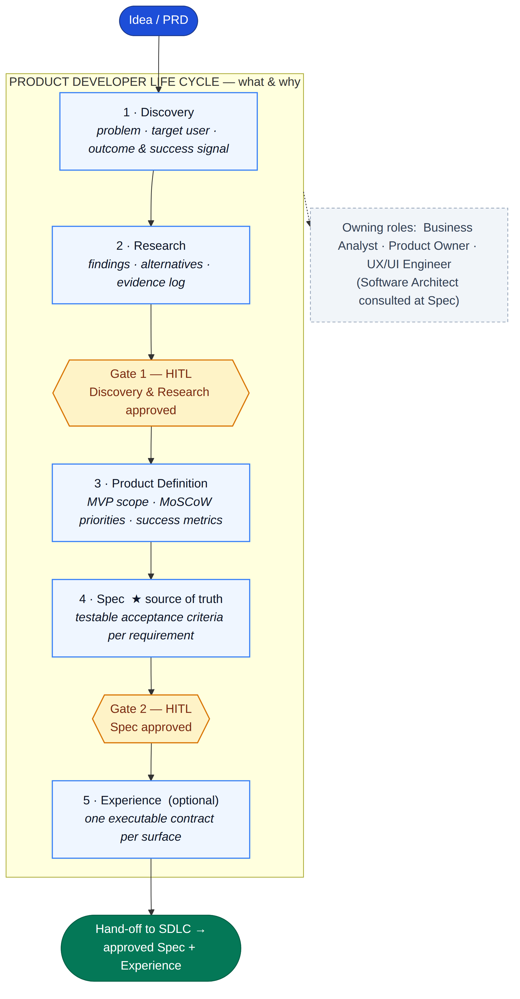
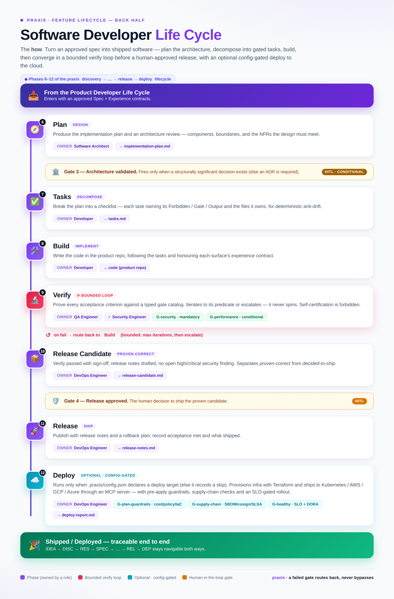

# praxis

[](https://github.com/sponsors/marcrabadan)
[](https://buymeacoffee.com/marcrabadan)

**A shared library of Claude Code skills.** A repo where a team captures *how it does things* — processes, conventions, roles, taste — once, in a format Claude Code reads and applies consistently across every project.

It has three parts:

1. **`skill-creator`** — the meta-skill that *is the pattern for creating new skills*. Use it to scaffold, review, classify, and validate any new skill.
2. **Thirteen SDLC expert skills** — one per role in the software delivery lifecycle (Business Analyst, Product Owner, Software Architect, Developer, QA Engineer, DevOps Engineer, Security Engineer, Cybersecurity Architect, UX/UI Engineer, Frontend Architect, Frontend Engineer, Data Engineer, ML/AI Engineer), each built with that pattern.
3. **`memory`** — a versioned *memory ledger* that records the plans, decisions (from any role, not just the architect), implementations, and artifacts the experts produce, each with a status from a closed set — `pending → accepted | rejected | rolled-back` (plus `superseded`) — so the record survives across sessions and changes can be rolled back. `pending` is a proposal awaiting your call, not approval to act.

On top of these, **[harness mode](#harness-mode-always-on)** gives agents a reliable *operating environment*, not just skills — a source-of-truth authority model, per-project memory, explicit stop conditions, machine-readable lifecycles with human-in-the-loop gates (`/new-feature`, `/fix-bug`, `/refine`), bidirectional traceability, and deterministic validators. It is **always on**: harness mode is praxis's default and only operating mode, and if a repo has no `.praxis/config.json`, the harness **auto-bootstraps** one (`tools/ensure_harness.py`) on the first command instead of falling back to a non-harness path.

**Just want to use it?** Jump to [Install & integrate](#install--integrate) for Claude Code, Cursor, IntelliJ, and Codex. **Want to see the output first?** Browse [`examples/`](examples/README.md) for sample transcripts. Otherwise: **PMs, designers, stakeholders** read from the top; **developers writing or shipping a skill** skip to the [Developer guide](#developer-guide).

---

## What is this repo?

`praxis` is a **factory for Claude Code skills**. A "skill" is a small package of instructions that teaches Claude Code how to do one specific thing your team's way — act as a particular SDLC expert, follow a review checklist, write requirements, design an architecture, and so on.

Every time someone teaches Claude a useful pattern, that knowledge is captured **once** here and becomes available to everyone. It is **not** a product repo — it holds the instructions Claude uses *when working on* product repos, not the products themselves.

## Install & integrate

Pick the path that matches how you work. The experts are **Claude Code native**; the same personas are also generated for **Cursor**, **IntelliJ**, and **OpenAI Codex** so you can use them from those tools too.

**Prerequisites:** [Claude Code](https://docs.claude.com/en/docs/claude-code) for the primary path. Python 3 is only needed if you want to *author* skills with the factory tooling (the validators use the standard library — no extra packages to install).

### Claude Code — install into another project (plugin marketplace)

To pull the experts into a *different* repo, `praxis` ships as a Claude Code **plugin marketplace** with a **single, self-contained plugin**. Run this from inside the target project:

```text
/plugin marketplace add marcrabadan/praxis
/plugin install praxis@praxis          # everything: SDLC experts + /new-feature + /review-changes + the skill factory (skill-creator, skill-learner / /learn, /validate-skills) + memory
```

One install brings the whole toolkit — including the skill factory, so the learning loop (`skill-learner`, which delegates to `skill-creator`) works out of the box. As plugins, commands are namespaced under the plugin name — `/praxis:architect`, `/praxis:new-feature`, `/praxis:learn`, `/praxis:validate-skills`, and so on.

Want just **one** skill, with no plugin? Copy the folder, or use the export target from inside this repo:

```bash
make export SKILL=software-architect TO=../my-product-repo   # → ../my-product-repo/.claude/skills/software-architect
# or by hand, including for user-wide scope:
cp -R .claude/skills/software-architect ~/.claude/skills/
```

### Cursor

The thirteen experts ship as Cursor **project rules** (auto-attaching) plus **commands**. Copy the generated `.cursor/` directory into your project root:

```bash
cp -R integrations/cursor/.cursor <your-repo>/
cp AGENTS.md <your-repo>/        # optional: Cursor reads AGENTS.md natively
```

Personas auto-attach when your request matches them; invoke one explicitly with `/architect`, `/developer`, `/security`, `/frontend`, … or run `/new-feature` and `/review-changes`. Details: [`integrations/cursor/`](integrations/cursor/README.md).

### IntelliJ (JetBrains AI Assistant & Junie)

Ships as Junie guidelines + persona guides + ready-to-paste prompts. Copy the generated `.junie/` directory into your project root:

```bash
cp -R integrations/intellij/.junie <your-repo>/
cp AGENTS.md <your-repo>/        # JetBrains AI Assistant reads AGENTS.md natively
```

Then ask Junie or the AI Assistant to *act as the praxis Software Architect* (or any role). IntelliJ has no repo-level slash commands, so the snippets in [`integrations/intellij/prompts/`](integrations/intellij/prompts/) are one-per-persona prompts you can save to the AI Assistant prompt library. Details: [`integrations/intellij/`](integrations/intellij/README.md).

### OpenAI Codex

```bash
# 1. Codex reads AGENTS.md natively — append the roster (or copy praxis's AGENTS.md):
cat integrations/codex/AGENTS.praxis.md >> <your-repo>/AGENTS.md
# 2. ship the persona guides with your code:
cp -R integrations/codex/.praxis <your-repo>/
# 3. install the slash commands:
cp integrations/codex/prompts/*.md ~/.codex/prompts/
```

Then type `/praxis-architect`, `/praxis-security`, `/praxis-new-feature`, … Details: [`integrations/codex/`](integrations/codex/README.md).

> The `cursor/`, `intellij/`, and `codex/` files are **generated** from the canonical Claude Code skills (`make integrations`) so they never drift — don't edit them by hand. See [`integrations/`](integrations/README.md) for the full wiring, including automatic PR review (CI) and a local pre-push nudge.

## What is a "skill"?

A skill is a **folder** under `.claude/skills/<name>/` containing a `SKILL.md` that Claude Code reads when it decides the skill is relevant. Claude decides in one of two ways:

- **You type a slash command** — e.g. `/software-architect`. This explicitly loads the skill.
- **You describe what you want** — e.g. "review this architecture and write an ADR". Claude matches your request against the skill's `description` and loads it on its own.

Once loaded, Claude follows the skill's instructions — which may include reading reference files, walking workflows step by step, or running scripts.

## What's inside a skill?

| File or folder   | What it is                                                                                             | Who reads it                |
| ---------------- | ------------------------------------------------------------------------------------------------------ | --------------------------- |
| `SKILL.md`       | **The entry point.** Frontmatter (`name`, `description`) + a short page telling Claude what the skill does, when to use it, and which reference/workflow to consult. | Claude, automatically.      |
| `references/`    | **Knowledge files.** Rules, examples, checklists — looked up when relevant. One topic per file.        | Claude, when relevant.      |
| `workflows/`     | **Step-by-step procedures** for multi-step skills.                                                     | Claude, in order.           |
| `scripts/`       | **Deterministic Python helpers** for things best not left to a guess.                                  | Claude, by running them.    |
| `evals/`         | **Test cases** — trigger cases (`should_trigger`) and expected-output expectations.                    | Validators / a future runner. |
| `skill-brief.md` | **Internal design doc** — purpose, decisions, iteration log. Stays in the factory.                     | Maintainers.                |

A small skill is just `SKILL.md`. A complex one has all of the above. How much structure a skill needs is set by its **tier**.

> **On evals today:** CI validates the *shape* of eval files (valid JSON, at least one positive and one negative trigger case). It does **not yet execute** them against a model — running trigger/output evals automatically is on the [roadmap](#roadmap). So evals currently document intended behavior; they don't prove it.

## Tiers — how complex is the skill?

| Tier | What it's for | Folders |
| ---- | ------------- | ------- |
| **1 — Basic** | A single rule or short guidance. | `SKILL.md` |
| **2 — Knowledge** | Reusable domain knowledge that would clutter `SKILL.md`. | `+ references/` |
| **3 — Workflow** | A multi-step procedure or multiple modes. | `+ workflows/` |
| **4 — Implementation** | Generates, modifies, or validates code/structured output. | `+ scripts/ + evals/` |
| **5 — Core** | Central, frequent, or high-risk skill needing extra harness. | `+ agents/ + reports/` |

The point of tiering is to **not overbuild**. Full criteria: [.claude/factory/ai/skill-tiering.md](.claude/factory/ai/skill-tiering.md).

## Talking to an expert

Each SDLC expert has a short slash command so you can address it directly with a question, instead of describing the role each time:

| Command | Expert | Example |
| ------- | ------ | ------- |
| `/architect` | Software Architect | `/architect how do I avoid this race condition under load?` |
| `/developer` | Developer | `/developer why does this function intermittently return null?` |
| `/qa` | QA Engineer | `/qa what edge cases am I missing for this checkout flow?` |
| `/analyst` | Business Analyst | `/analyst turn this idea into user stories with acceptance criteria` |
| `/product` | Product Owner | `/product how should I prioritize these five backlog items?` |
| `/devops` | DevOps Engineer | `/devops is this service ready to ship to production?` |
| `/security` | Security Engineer | `/security threat-model this upload endpoint and find the vulns` |
| `/security-architect` | Cybersecurity Architect | `/security-architect design the IAM and segmentation for this platform` |
| `/ux` | UX/UI Engineer | `/ux check the contrast and focus states on this form` |
| `/frontend-architect` | Frontend Architect | `/frontend-architect SSR or SSG for this catalog, and where should state live?` |
| `/frontend` | Frontend Engineer | `/frontend why does this list re-render on every keystroke?` |
| `/data` | Data Engineer | `/data design an idempotent incremental load for this orders pipeline` |
| `/ml` | ML/AI Engineer | `/ml is there leakage in these features, and what metric should I optimize?` |

Each command loads its matching skill and answers in that persona. You can also just describe what you want and Claude will load the right expert on its own. Command definitions live in [.claude/commands/](.claude/commands/).

To run a feature through the **full lifecycle** — `discovery → research → spec → plan → tasks → build → verify → release`, driven by the core six (BA → PO → architect → developer → QA → devops), each building on the last — use `/new-feature <idea or PRD>`. It starts by *understanding* (discovery) and *investigating* (research, which must precede the spec), then produces one consolidated plan (requirements, prioritized increments, design decisions, implementation plan, test strategy, rollout, release notes), pausing at human-in-the-loop gates. Each phase runs in its own subagent, so an expert's doctrine loads in an isolated context and only its compact artifact returns to the main thread; prior artifacts are carried forward so context still flows across phases. After the architect phase it also **routes in the specialist experts a feature warrants** — ML/AI, data, security, frontend, or UX — as extra parallel phases, so an ML- or security-heavy feature gets its specialist automatically. Those experts also sit alongside the lifecycle for direct use (`/ml`, `/data`, `/security`, …), and `/review-changes` brings them in when a diff warrants it.

Not every change is a greenfield feature. For a defect, `/fix-bug <bug>` runs the **corrective** lifecycle — `triage → reproduce → diagnose → fix → verify` — to produce a minimal, regression-tested fix without the discovery/research/spec ceremony. For internal quality work, `/refine <target>` runs the **behavior-preserving** lifecycle — `assess → plan → change → verify` — to refactor, pay down debt, or improve performance while keeping observable behavior unchanged. Both are orchestrated the same way as `/new-feature`, just lighter.

Not sure which of these a raw idea is? `/idea <a half-formed thought>` is the **intake & triage front door**: it clarifies (≤2 questions), classifies the idea (feature / bug / refinement / not-worth-doing), captures it as a `pending` note in the memory ledger, and recommends the right lifecycle command to run next — it triages and routes, it does not plan.

**Token-efficient by construction.** Beyond context isolation, `/new-feature` keeps cost down two more ways. An optional **context digest** step gathers the relevant codebase/PRD context *once* on the cheap `light` tier and feeds that digest to every later phase, so experts stop re-reading the same material. And each phase runs at the **semantic model tier its work needs** — `standard` by default for every phase, `deep` only where reasoning depth demonstrably pays (a hard design, a complex root cause, a high-stakes domain analysis), `light` for retrieval only. Tiers are never hardcoded vendor models: the per-repo `.praxis/config.json` `models` map resolves each tier to whatever model your runtime offers (on Claude Code the fallback is `haiku`/`sonnet`/`opus`; you can map `deep` higher — e.g. `fable` — or remap everything for another runtime like Codex). Doctrine: [`rules/model-tiers.md`](rules/model-tiers.md).

### See it in action

Sample transcripts — the prompt you type and a representative response — live in [`examples/`](examples/README.md). Most follow one running feature (saved payment methods at checkout) so you can watch it move through requirements, architecture, build, and review:

| Sample | Shows |
| ------ | ----- |
| [new-feature.md](examples/new-feature.md) | `/new-feature` → the core six's consolidated plan |
| [architect-adr.md](examples/architect-adr.md) | `/architect` → a decision captured as an ADR |
| [analyst-user-stories.md](examples/analyst-user-stories.md) | `/analyst` → INVEST stories + Gherkin acceptance criteria |
| [review-changes.md](examples/review-changes.md) | `/review-changes` → severity-tagged, didactic findings |
| [security-threat-model.md](examples/security-threat-model.md) | `/security` → a STRIDE threat model with mitigations |
| [ml-evaluation.md](examples/ml-evaluation.md) | `/ml` → leakage check, the right metric, and a safe rollout |

## Wiring the experts into your workflow

Consulting an expert is *pull* — you have to remember to ask. To **catch bad practices at the moment they happen**, wire the experts into your dev flow so they show up on their own:

- **`/review-changes`** reviews the current diff, routes to only the relevant experts (developer / qa / architect / devops / security / security-architect), and returns **severity-tagged, didactic** findings — each says *what* the bad practice is, *why* it matters, and *how* to fix it. A junior learns from it; a senior skims by severity; an architect sees the team's standards enforced.
- Make it **automatic**: a GitHub Action runs it on every PR, and a local hook nudges you before you push. Both are opt-in templates in [`integrations/`](integrations/README.md).
- **Remember what you decided and built.** The `memory` ledger (`/memory`) records plans, decisions, and changes as durable, git-committed entries you can accept, reject, or roll back. An opt-in hook surfaces what's still pending at session start and snapshots changes when you stop — see [The memory ledger](#memory-tier-4--the-working-memory-ledger).
- **Use the same experts in other agents.** The personas and workflows are also generated for **Cursor**, **IntelliJ** (JetBrains AI Assistant & Junie), and **OpenAI Codex**, each in that tool's native format — see [`integrations/`](integrations/README.md#4-other-agents-cursor-intellij-openai-codex). All three read `AGENTS.md` natively for repo-wide doctrine.

## The skills in this factory today

### `skill-creator` (Tier 5 — the meta-skill / the pattern)

The pattern for creating new skills. You describe what you want; it runs a guided interview (one question at a time), picks the right tier, scaffolds the folder deterministically, and validates the result. Two capabilities worth calling out:

- **General-purpose interview** — the one-question-at-a-time workflow works for scoping *any* objective, not only skills.
- **Iteration capture (a learning loop)** — when you correct its output ("actually, always do X"), it asks whether to record that as a durable rule for the skill or a meta-rule for the factory (`learned-rules.md`), so the same correction is never needed twice.

### The thirteen SDLC expert skills (Tier 2)

Each makes Claude act as that role's expert, with practices and a review checklist:

| Skill | Role | Covers |
| ----- | ---- | ------ |
| `business-analyst` | Business Analyst | Requirements elicitation, user stories (INVEST + Gherkin), process modeling, traceability, MoSCoW. |
| `product-owner` | Product Owner | Backlog ordering, prioritization (RICE/WSJF/Kano), Definition of Ready/Done, OKRs, story splitting. |
| `software-architect` | Software Architect | NFRs, ADRs, trade-offs, C4 model, pattern selection, risk, avoiding over-engineering. |
| `developer` | Developer | Clean code, TDD/test pyramid, commit & PR hygiene, safe refactoring, security basics, review etiquette. |
| `qa-engineer` | QA Engineer | Test strategy, test-design techniques, bug reports, risk-based & regression testing, release readiness. |
| `devops-engineer` | DevOps Engineer | CI/CD, IaC, containers/K8s, deployment strategies, observability/SLOs, incident response, DORA. |
| `security-engineer` | Security Engineer | Threat modeling (STRIDE), OWASP Top 10, authn/authz, secrets, crypto, SAST/DAST/SCA, supply chain, CVSS triage. |
| `cybersecurity-architect` | Cybersecurity Architect | Zero trust, defense in depth, IAM/identity, segmentation, data protection, key management, NIST/ISO/CIS, compliance, risk. |
| `ux-ui-engineer` | UX/UI Engineer | Design systems & tokens, visual & interaction design, accessibility (WCAG 2.2 AA), responsive layout, usability heuristics, UX writing, design handoff. |
| `frontend-architect` | Frontend Architect | Framework & rendering strategy (SSR/SSG/ISR/RSC), state/data/routing architecture, build & bundling, micro-frontends, design-system architecture, Core Web Vitals. |
| `frontend-engineer` | Frontend Engineer | Component implementation, state & data wiring, forms, styling, frontend TypeScript, re-render/performance, accessibility implementation, component/E2E testing. |
| `data-engineer` | Data Engineer | Batch & streaming pipelines (ETL/ELT, CDC), warehouse/lake/lakehouse & dimensional modeling, orchestration (dbt/Airflow/Dagster), data quality & contracts, lineage & governance, partitioning, DataOps & cost. |
| `ml-ai-engineer` | ML/AI Engineer | Problem framing & metrics, ML-ready features (leakage, train/serve skew, feature stores), training & evaluation, experiment tracking, serving & deployment (shadow/canary/A-B), MLOps, drift monitoring & retraining, responsible AI, LLM/GenAI (RAG, prompting, fine-tuning, evals, guardrails). |

### `memory` (Tier 4 — the working-memory ledger)

The experts produce plans, decisions, and code — `memory` makes that output **stick**. It's a versioned ledger, committed to git under `.praxis/memory/`, so the record survives across sessions, machines, and the next person to open the repo.

- **What it stores:** `plan`, `decision` (mini-ADRs, from any role — the PO, QA, DevOps or security, not just the architect), `implementation`, `artifact`, `test-strategy`, `rollout`, and `note` entries — each with provenance (which command/skill produced it) and a status from a **closed set** the CLI enforces: `pending`, `accepted`, `rejected`, `superseded`, `rolled-back`. No status outside those five is ever invented, and `pending` means *awaiting your call* — not approval to act.
- **Seed it once with `/memory init`:** the bootstrap flow primes an empty ledger from the repo's existing context — `AGENTS.md`, ADRs, architecture docs, and git history — so memory reflects the project from day one instead of only what happens after adoption. (Claude Code has no on-install hook; this is the explicit one-time seed, and the SessionStart hook nudges you to run it whenever the ledger is empty.)
- **Rollback:** implementation entries are captured as a `snapshot` that stores a reverse-appliable patch, so a change can be undone — with a safe dry-run — even sessions later.
- **Drive it with `/memory`:** `init`, `list`, `pending`, `show <id>`, `accept <id>`, `reject <id>`, `rollback <id>`, `status`. Everything goes through a deterministic, stdlib-only CLI (`.claude/skills/memory/scripts/ledger.py`) — never hand-edit the ledger.
- **Make it automatic:** an opt-in hook ([`integrations/hooks/memory.settings.example.json`](integrations/hooks/memory.settings.example.json)) ensures the ledger exists, nudges you to seed it when empty, surfaces pending entries at **SessionStart**, and snapshots uncommitted changes on **Stop**. Paired with the *“leave a record”* rule in [`AGENTS.md`](AGENTS.md), the hook captures *what* changed while the experts record *why*. `/new-feature` and `/review-changes` already log their artifacts.

```text
/memory init                 # seed the ledger from the repo's existing context
/memory                      # status + what's still pending
/memory accept 20260601-153012-9af3
/memory rollback 20260601-153012-9af3   # dry-run first, reverts the working tree
```

---

## Harness mode (always on)

Praxis began as a **skill factory + SDLC expert pack + memory ledger**. Harness mode turns it into a fuller **agent harness**: a reliable operating environment that tells an agent *where to read first, what is canonical, where durable decisions go, how project context is resolved, and when to stop and ask*. It carries the authority model **and** the full delivery lifecycle — discovery, research, specs, plans, tasks, verification, and release, plus lighter lifecycles for bugs and refinements. **It is praxis's default and only operating mode** — there is no opt-in and no non-harness fallback. If a repo has no `.praxis/config.json`, the harness **auto-bootstraps** one (a `local` project derived from the repo name, via `python tools/ensure_harness.py` — idempotent) on the first command and continues; the one hard stop is a config that is *present but broken*. See [`docs/harness-mode.md`](docs/harness-mode.md) for the full guide.

### The lifecycle at a glance

Praxis splits its full feature lifecycle into two halves — a **Product Developer Life Cycle** (the *what & why*: discovery → research → product definition → spec → experience) and a **Software Developer Life Cycle** (the *how*: plan → tasks → build → verify → release). Each phase is owned by a role and every gate is human-in-the-loop.

<table>
<tr>
<td width="50%" valign="top" align="center">
<a href="docs/diagrams/product-developer-life-cycle.png"></a>
<br /><sub><b>Product Developer Life Cycle</b> — BA · PO · UX</sub>
</td>
<td width="50%" valign="top" align="center">
<a href="docs/diagrams/software-developer-life-cycle.png"></a>
<br /><sub><b>Software Developer Life Cycle</b> — Architect · Dev · QA · DevOps · Security</sub>
</td>
</tr>
</table>

Sources: [`docs/diagrams/`](docs/diagrams/) — the PNGs render from the `*.infographic.html` posters via [`render.js`](docs/diagrams/render.js); a plain Mermaid `.mmd` variant of each sits alongside. The full step and gate definitions live in [`workflows/feature-development.workflow.json`](workflows/feature-development.workflow.json) and [`systems/feature-development/artifact-model.md`](systems/feature-development/artifact-model.md).

What it adds (all repo-level, alongside the factory):

| Path | Purpose |
| ---- | ------- |
| [`rules/source-of-truth.md`](rules/source-of-truth.md) | What is canonical vs generated vs runtime, and the **authority order** to follow on conflict. |
| [`rules/stop-conditions.md`](rules/stop-conditions.md) | When an agent must **stop and ask** instead of guessing (and the hard blocks). |
| [`projects/`](projects/projects-index.md) | **Per-project memory**: `PROJECT.md`, `linked-repos.md`, and `memory/current-state.md` + `open-questions.md`. Copy `projects/_template/` to start one. |
| [`schemas/`](schemas/) | `project.schema.json` (PROJECT.md frontmatter) and `praxis-config.schema.json` (a consuming repo's `.praxis/config.json`). |
| [`tools/validate_harness.py`](tools/validate_harness.py) | A **deterministic** validator (no LLM) for the registry, project memory, schemas, and config. Wired into `make validate-harness` and CI. |

**Per-repo or central?** Harness mode is **hybrid, with `local` (per-repo) as the default** and `central` as an opt-in for multi-repo teams. **Several repos for one product** (e.g. two backend + two frontend) → **one project, `central` mode**, with each repo carrying the same `projectId`; specs and decisions stay consistent across the repos. A worked example spanning four repos lives at [`examples/multi-repo/`](examples/multi-repo/README.md) (project: [`projects/helios/`](projects/helios/PROJECT.md)). For working **as a team** — 1→many people or several teams, concurrently, **without duplicating SPEC/REQ** — see [`docs/teamwork.md`](docs/teamwork.md): the spec folder is the unit of parallel work, ids are collision-safe, and `activeSpec` stays per-session. A consuming repo opts in with a small pointer, [`examples/praxis-config.example.json`](examples/praxis-config.example.json):

```json
{
  "schemaVersion": "1.0.0",
  "harnessRoot": "../praxis",
  "projectId": "checkout",
  "mode": "local",
  "activeSpec": null
}
```

If `projectId` can't be resolved, the agent **stops** (per the stop conditions). Start a project and validate it:

```bash
cp -r projects/_template projects/checkout   # then edit PROJECT.md (id = folder name)
#                                            #  + add a row to projects/projects-index.md
make validate-harness                        # registry · memory shape · schemas · config
python tools/validate_harness.py --config ../checkout/.praxis/config.json
```

**Read order** in a harness-mode repo: repo `AGENTS.md` → `.praxis/config.json` → harness `AGENTS.md` → `rules/source-of-truth.md` → `projects/<project>/PROJECT.md` → `current-state.md` → `open-questions.md` → active spec → relevant skills. The generated Cursor / Codex / IntelliJ entry docs embed the same order, so every agent resolves context the same way.

**What harness mode now includes** (always on — a missing project is auto-bootstrapped, never a fallback):

- **The full feature lifecycle.** In harness mode, `/new-feature` runs `discovery → research → product-definition → spec → experience → plan → tasks → build → verify → release-candidate → release` and writes the durable, typed artifacts under `projects/<project>/specs/<spec>/` — `discovery/`, `research/` (report + evidence log + alternatives), the PO-owned `product-definition` (MVP/scope/metrics), `spec.md`, optional `experience/` contracts, `plans/implementation-plan.md`, `tasks/tasks.md`, `decisions/`, `reports/verify/`, and `reports/release/` (with `release-candidate` separating *proven-correct* from *decided-to-ship*) — instead of leaving the plan only in chat. **Research precedes the spec.** Doctrine: [`systems/feature-development/artifact-model.md`](systems/feature-development/artifact-model.md).
- **Executable surface contracts + typed gates.** The optional `experience` step turns each surface a spec declares (screen/flow/api/job/cli/data/integration) into a verifiable contract — markdown + a companion JSON validated against [`schemas/experience-contract.schema.json`](schemas/experience-contract.schema.json) — that names its source of truth, files-owned, dependency map, and the `G-*` gates that prove it. The workflow's `gateCatalog` defines those gates; the verify report records a pass/fail result per gate with reviewer sign-off and **forbids self-certification**. Tasks carry per-task **Forbidden / Gate / Output** fields + files-owned for deterministic anti-drift (lint: `make check-tasks FILE=…`).
- **Never assume; loop, don't spin; hard stops.** Three complementary controls keep work honest: the **assumptions ledger** ([`rules/never-assume.md`](rules/never-assume.md), `tools/assumptions.py`) logs low-confidence guesses and replays them to you as a question-flow; **loop control** ([`rules/loop-control.md`](rules/loop-control.md), `tools/loop.py`) runs the `verify` step as a bounded convergence loop that either meets its predicate or escalates — never spins; and an enumerated **stop-conditions catalog** ([`rules/stop-conditions-catalog.md`](rules/stop-conditions-catalog.md)) of `U/P/S-*` hard blockers halts the step and writes a run log.
- **A learning loop.** A validated assumption that generalises can be promoted — via [`tools/promote.py`](tools/promote.py), routed through `skill-learner` — into a **`pending`** rule, gate, eval, or guardrail in the memory ledger. Promote on evidence, never on anticipation; propose, never mutate; the user accepts before any governance is added.
- **Lighter lifecycles for bugs and refinements.** `/fix-bug` drives the corrective `triage → reproduce → diagnose → fix → verify` chain ([`systems/bug-fix/`](systems/bug-fix/artifact-model.md)); `/refine` drives the quality-only, behavior-preserving `assess → plan → change → verify` chain ([`systems/refinement/`](systems/refinement/artifact-model.md)). Both skip the discovery/research/spec ceremony a feature needs.
- **Workflow gates + HITL, with an owning authority.** [`workflows/`](workflows/registry.json) holds machine-readable lifecycles (steps, gates, stop conditions). The feature chain has **five criteria-checked human-in-the-loop gates** — `approved-discovery`, `approved-product-definition`, `approved-spec`, `architecture-validated`, and `release-candidate-ready` — each carrying explicit, checkable criteria (`gateCriteria`) so an approval is a checklist, not a vibe. The **[Validation Orchestrator](.claude/skills/validation-orchestrator/SKILL.md)** (`/validation-orchestrator`) is the standing role with sole authority to halt progression, adjudicating each gate to a closed-set verdict (`advance | block | escalate`). A failed gate routes back to its mapped rework state (`transitions.onGateFailure`) — never a bypass. Each gate is opened by the previous artifact reaching an authorizing status. **Pending is not approval.**
- **A typed verify gate catalog with a mandatory security gate.** The verify loop proves a closed set of `G-*` gates (`G-build`, `G-lint`, `G-typecheck`, `G-tests`, `G-runtime-clean`, `G-acceptance`, …). **`G-security` is mandatory** — a feature cannot reach `release` without a recorded security review (owned by `security-engineer`); high/critical findings are fixed or carry an approved risk-acceptance decision. **`G-performance` is conditional** on runtime-bearing surfaces, owned by `software-architect` (build-time budgets) and `devops-engineer` (runtime SLOs). The verify report records a pass/fail per gate with reviewer sign-off and **forbids self-certification**.
- **Continuous learning — a pattern miner.** `make patterns` / `/patterns` ([`tools/patterns.py`](tools/patterns.py)) sweeps the memory ledger and stop-condition run logs for recurring tags, sources, and stop conditions, and surfaces them as **human-gated promotion candidates** routed into `/learn`. The reactive half of the learning loop (`promote.py`) captures gaps as they happen; the miner is the proactive half that asks "what keeps happening?".
- **Traceability.** Every artifact carries a typed id and links via `source:` / `traces:`, so the chain `IDEA → DISC → RES → SPEC → … → REL` is navigable both ways. Convention: [`rules/traceability.md`](rules/traceability.md); advisory check: `make validate-traceability`.
- **Project-aware review.** In harness mode, `/review-changes` loads the project's authority, accepted decisions, and active spec, flags diffs that contradict them, and records outcomes only as `pending` memory entries.
- **Always-on bootstrap.** [`tools/ensure_harness.py`](tools/ensure_harness.py) is the idempotent guarantee that harness mode is always on: run at the start of every lifecycle command, it auto-bootstraps a project (config + project memory) derived from the repo name when none resolves, and is a no-op once initialized. [`tools/install_adapter.py`](tools/install_adapter.py) is the explicit variant for wiring a consuming repo to a *named, pre-existing* project (`.praxis/config.json` + `.praxis/current-spec.md`).
- **Runtime state.** [`runtime/`](runtime/README.md) holds disposable session glue (last active project/repo/spec) via [`tools/runtime.py`](tools/runtime.py) — git-ignored, never the home of a durable decision.

### Try harness mode end to end

```bash
# 1. Scaffold a project inside the harness (central mode) — or use install_adapter for a product repo
cp -r projects/_template projects/checkout
#    edit projects/checkout/PROJECT.md  (frontmatter id = checkout, set name + status)
#    add a row for `checkout` to projects/projects-index.md
make validate-harness                 # must pass before you go further

# 2. Point a consuming repo at the harness (or run inside praxis itself)
python tools/install_adapter.py --target ../checkout --project checkout --mode local
#    writes ../checkout/.praxis/config.json + current-spec.md

# 3. Drive a lifecycle — from inside the repo that has .praxis/config.json
#    /new-feature "<idea>"   → writes projects/checkout/specs/<slug>/ (discovery → … → release)
#    /fix-bug "<bug>"        → writes projects/checkout/bugs/<id>/
#    /refine "<target>"      → writes projects/checkout/refinements/<id>/

# 4. Respect the gates: the spec stays status: draft until you ACCEPT it; the
#    plan stays a pending ledger decision until you accept it. Pending ≠ approval.

# 5. Validate the harness state and the traceability links at any point
make validate-harness
make validate-traceability            # advisory: checks source:/traces: ids resolve
```

To try it **without a separate repo**, scaffold a project under `projects/` as in step 1, add a `.praxis/config.json` at the repo root pointing `harnessRoot` at `.` with `projectId: checkout`, then run `/new-feature` — it will write artifacts under `projects/checkout/specs/`.

Still deliberately out of scope (add on evidence, not anticipation): a full SDD Kit, central-mode sync tooling, and extending the mandatory security/performance gates to the lighter `bug-fix` and `refinement` lifecycles.

---

## Developer guide

### Quick start

1. Read [AGENTS.md](AGENTS.md) — the single source of truth for agent behavior in this repo.
2. To create a new skill, invoke the meta-skill: type `/skill-creator` (or just "I want a skill for X"). It loads [.claude/skills/skill-creator/SKILL.md](.claude/skills/skill-creator/SKILL.md).
3. The skill-creator runs the interview, classifies the tier, scaffolds via `create_skill.py`, and validates.
4. Promote finished skills from `dist/<name>/` to `.claude/skills/<name>/` when they become shared assets — Claude Code then discovers them automatically.

### Using these skills in another project

See [Install & integrate](#install--integrate) above for the plugin, single-skill copy, and Cursor / IntelliJ / Codex paths. A few notes for maintainers:

- **`praxis`** — one self-contained plugin with everything: the on-demand SDLC team (the expert skills, their per-expert commands, and the `/new-feature` orchestrator) **and** the skill factory — `skill-creator` for authoring skills, `skill-learner` (`/learn`) for turning knowledge gaps discovered mid-task into durable skills, `/validate-skills`, and the memory ledger. Shipping the factory in the same plugin means the learning loop (`skill-learner` delegates to `skill-creator`) always has its dependency, with no second install to remember.
- Every skill carries a `version` (semver) in its frontmatter, so a consuming repo can tell when its copy is behind. Keep authoring and iteration inside `praxis`, since the factory depends on `.claude/factory/ai/`, `.claude/factory/templates/`, and `.claude/factory/validators/`.

### The catalog

`SKILLS.md` is a generated index of every skill (name, version, tier, description) and command. Regenerate it with `make catalog`; CI fails if it is stale, so it always reflects what is actually in the repo.

### Shortcuts

| Tool | How to invoke |
| ---- | ------------- |
| `make` | `make help` |
| VS Code Tasks | Cmd/Ctrl+Shift+P → "Run Task" → pick a `skills: ...` task ([.vscode/tasks.json](.vscode/tasks.json)) |
| Raw Python | see below |

### Run the validator directly

```bash
python .claude/factory/validators/validate_skill.py .claude/skills/skill-creator
make validate-all          # validate every skill in .claude/skills/ and dist/
```

Or, inside Claude Code, run `/validate-skills` — it wraps `make validate-all` and reports failures with the exact error lines.

### Run the generator directly (skip the interview)

```bash
python .claude/skills/skill-creator/scripts/create_skill.py \
  --brief dist/my-skill/skill-brief.md \
  --tier 3 \
  --name my-skill \
  --out dist/my-skill
```

### Continuous integration

Pushes and PRs against `main` run [.github/workflows/validate.yml](.github/workflows/validate.yml): it validates every skill in `.claude/skills/` and `dist/`, runs a generator determinism check (and asserts no `command.md` is emitted), verifies `SKILLS.md` is up to date, validates harness state (`tools/validate_harness.py`), and sanity-checks the JSON schemas.

### Key concepts

- **Tiers (1–5).** Every skill is classified by complexity before scaffolding. See [.claude/factory/ai/skill-tiering.md](.claude/factory/ai/skill-tiering.md).
- **Interview-first.** When intent is incomplete, an interview captures purpose, triggers, output format, and rules. See [.claude/skills/skill-creator/workflows/interview.md](.claude/skills/skill-creator/workflows/interview.md).
- **Deterministic scaffolding.** `create_skill.py` consumes a `skill-brief.md` + tier and emits the folder. Same input → same output.
- **Validators run before done.** No skill is shipped until [.claude/factory/validators/validate_skill.py](.claude/factory/validators/validate_skill.py) passes.

### Repo layout

```
praxis/
├─ AGENTS.md              # global doctrine (read first)
├─ CLAUDE.md              # pointer to AGENTS.md
├─ README.md              # this file
├─ Makefile               # `make help` for short commands
├─ .vscode/tasks.json     # equivalent tasks for VS Code
├─ .github/workflows/     # CI: validates every skill on push / PR
├─ SKILLS.md              # generated catalog of skills + commands (make catalog)
├─ examples/              # sample transcripts + praxis-config.example.json
├─ docs/                  # GitHub Pages site + harness-mode.md guide
├─ rules/                 # harness mode: source-of-truth, stop-conditions (+catalog), never-assume, loop-control, traceability
├─ projects/              # harness mode: per-project memory (_template + index + specs)
├─ systems/               # harness mode: lifecycle doctrine (feature-development, bug-fix, refinement)
├─ workflows/             # harness mode: machine-readable lifecycles (steps, gates, gate catalog, loops)
├─ schemas/               # harness mode: project/config/spec/workflow/session + experience-contract/assumption/loop/stop-conditions
├─ runtime/               # harness mode: disposable session state (git-ignored)
├─ tools/                 # harness mode: ensure_harness (always-on bootstrap) / validate_harness / install_adapter / runtime / assumptions / loop / promote / check_tasks
├─ .claude-plugin/        # marketplace.json (lists the single praxis plugin)
├─ plugin-praxis/         # plugin: symlinks to every expert + skill-creator + skill-learner + memory + factory + their commands
├─ .claude/               # the real source of truth (used when this repo is the workspace)
│  ├─ skills/             # skill-creator + skill-learner (meta) + the SDLC experts + memory
│  ├─ commands/           # /architect, …, /new-feature, /fix-bug, /refine, /memory, /learn, /validate-skills
│  └─ factory/            # all skill-authoring tooling + doctrine
│     ├─ ai/              # operating model, tiering, routing, principles, promotion policy, glossary
│     ├─ templates/       # tier-1..5 scaffolds + eval template
│     ├─ schemas/         # JSON Schema for skill + eval shapes
│     ├─ scripts/         # repo-level tooling (catalog generator)
│     └─ validators/      # deterministic Python validators
└─ dist/                  # scratch for new skills (gitignored)
```

The `plugin-*/` folders are thin shells of symlinks into `.claude/` — the real files live once under `.claude/`, and the plugin cache dereferences the symlinks at install time.

### Conventions

- Use forward slashes in markdown links and skill paths, not backslashes.
- Skill `name` is lowercase, hyphens only, max 64 chars (regex `^[a-z0-9-]{1,64}$`).
- Skill `description` is trigger-rich, third-person, max 1024 chars, and includes both **what** the skill does and **when** to use it.
- `SKILL.md` body stays under 500 lines. Long knowledge moves to `references/`, multi-step procedures move to `workflows/`.

## Roadmap

What exists today is strong at **creating** skills. The gaps below are what stand between this repo and a product other teams could adopt — listed so contributors know where the edges are. Per [.claude/factory/ai/promotion-policy.md](.claude/factory/ai/promotion-policy.md), build these on evidence of need, not anticipation.

- **Eval runner.** Execute `trigger-evals.json` and `output-evals.json` against a model and report pass/fail, so a skill's behavior is *measured*, not just asserted. Today CI only checks eval shape.
- **Usage telemetry.** Capture which skills trigger, how often, and with what outcome — the evidence the promotion policy already assumes exists.
- **Versioned distribution.** Build on the `version` frontmatter and `make export`/`SKILLS.md` toward a real publish/update flow (changelog, update detection in consuming repos).
- **Multi-environment support.** This library is Claude Code native. Re-introducing exporters for other agent tools would widen the addressable audience.
- **Generalization & governance.** The SDLC skills are generic best practices; differentiation comes from team-specific IP and integrations, plus a contribution/ownership process for shared skills.

## License

Licensed under the [Apache License 2.0](LICENSE). See [NOTICE](NOTICE) for
attribution and [CHANGELOG.md](CHANGELOG.md) for the release history.

## Versioning

This project follows [Semantic Versioning](https://semver.org/). The two
distributable plugins each carry a `version` in their
`.claude-plugin/plugin.json` (mirrored in `.claude-plugin/marketplace.json`),
and the repository as a whole is tagged `vX.Y.Z` at each release. Changes are
recorded in [CHANGELOG.md](CHANGELOG.md).
