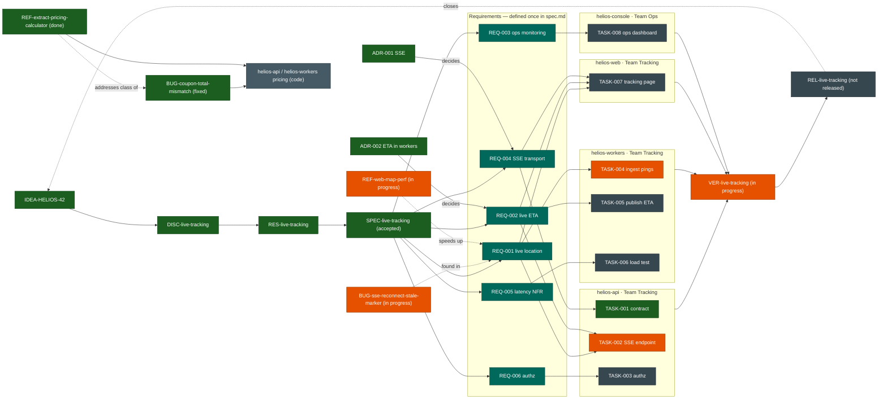

<!-- Generated for the Helios example project. Source: projects/helios/ artifacts. -->

# Helios — Traceability map

Bidirectional map of the Helios product's artifacts: the `live-tracking` feature
chain (`IDEA → DISC → RES → SPEC → REQ → TASK → VER → REL`) plus the corrective
(`BUG-`) and quality-only (`REF-`) lifecycles and how they link back to the
requirements. Colours show **status**. Requirements are defined **once** in
`specs/live-tracking/spec.md`; tasks reference them by id, never copy them.

**Legend (status):** 🟢 green = accepted / done / fixed · 🟠 amber = in progress ·
⚫ grey = todo / pending / not released · 🟦 teal = requirement (defined once).

**How to read it**

- The spine `IDEA → DISC → RES → SPEC` is the feature being understood, researched,
  then specified — research precedes the spec.
- `ADR-001` / `ADR-002` *decide* requirements (transport, where ETA is computed).
- Each `TASK-` traces up to the `REQ-` it implements; tasks are grouped by repo and
  team. The same `REQ-001` is implemented across `helios-api`, `helios-workers`,
  and `helios-web` by **reference**, never duplicated.
- All four repos' work feeds `VER-live-tracking`; `REL-` closes the originating idea.
- `BUG-` and `REF-` are lighter lifecycles: the SSE bug and the map refinement link
  back to `REQ-001`; the pricing bug and the pricing-extraction refinement share a
  code area, and the refinement removes the duplication that bred the bug.
